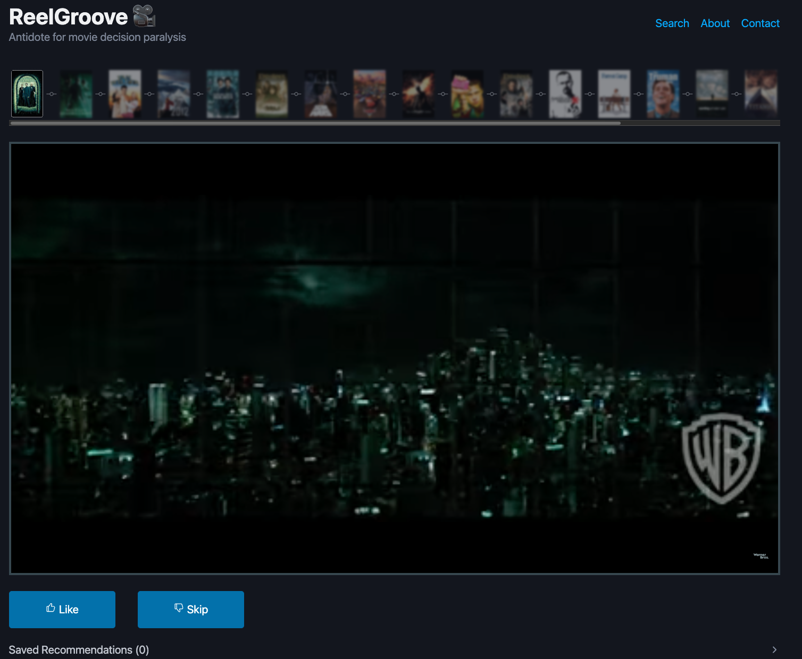

# ReelGroove



### Instructions to Run
1. Install docker with docker-compose
2. Request a free dev TMDB api key [here](https://www.themoviedb.org/settings/api)
3. Create a `.env` file in the `server` folder. It only needs one entry:
```.env
TMDB_API_KEY=<your api key here>
```
> This file is gitignored

4. Run the compose services with `docker compose up -d`
5. Visit `http://localhost:8080/search`

### Future Features
- Persist redis so that cached data isn't lost when redis dies
- Add support for user profiles, sign-ups and sign-in, to save liked movies for later review
    - Also implies will need to add db
- While watching one reel, allow user to start a new reel from any movie in the current one
- Allow users to build their OWN reels. Have a search / categorization / sharing / discovery page for this.
- Start random reels from genres
- Maybe some more info about reel's base movie and current trailer
- Add logic to fetch more pages of data from TMDB for longer reels
- Improved summary page (more info, more to do?)
- Better error handling
- Logo
- Better TMDB and JustWatch attribution with [logos](https://www.themoviedb.org/about/logos-attribution)
- Maybe consider different word than "reel", might be confusing with instagram...
- Add support for TV shows
